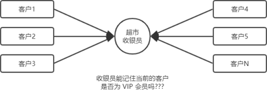
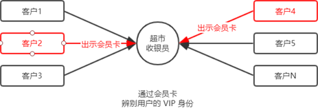
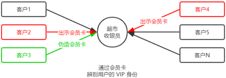
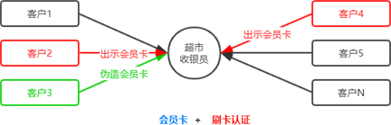
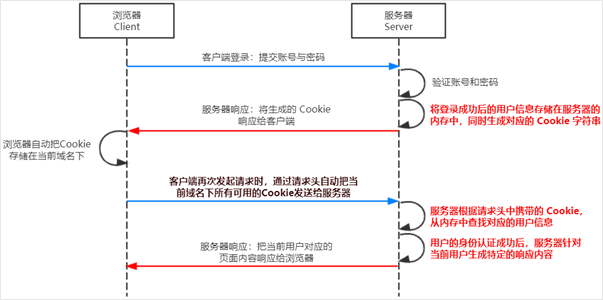
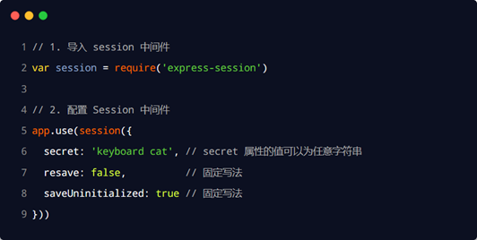
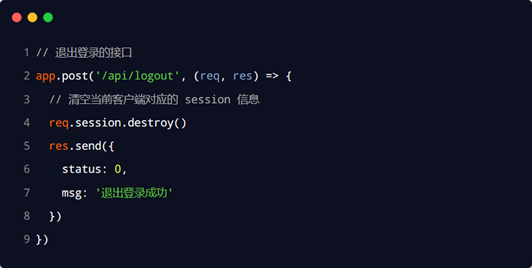

# 身份认证

## 基本概念

### 什么是身份认证

**身份认证**（Authentication）又称“身份验证”、“鉴权”，是指**通过一定的手段，完成对用户身份的确认**。

+ 日常生活中的身份认证随处可见，例如：高铁的验票乘车，手机的密码或指纹解锁，支付宝或微信的支付密码等。

+ 在 Web 开发中，也涉及到用户身份的认证，例如：各大网站的**手机验证码登录**、**邮箱密码登录**、**二维码登录**等。

### 为什么需要身份认证

身份认证的目的，是为了**确认当前所声称为某种身份的用户，确实是所声称的用户**。例如，你去找快递员取快递，你要怎么证明这份快递是你的。

在互联网项目开发中，如何对用户的身份进行认证，是一个值得深入探讨的问题。例如，如何才能保证网站不会错误的将“马云的存款数额”显示到“马化腾的账户”上。

### 不同开发模式下的身份认证

对于服务端渲染和前后端分离这两种开发模式来说，分别有着不同的身份认证方案：

① 服务端渲染推荐使用 **cookit+Session** **认证机制**

② 前后端分离推荐使用 **JWT(token)** **认证机制**

## cookie介绍

### http是无状态的

了解 HTTP 协议的无状态性是进一步学习 Session 认证机制的必要前提。

HTTP 协议的无状态性，指的是客户端**的每次** **HTTP** **请求都是独立的**，连续多个请求之间没有直接的关系，**服务器不会主动保留每次** **HTTP** **请求的状态**。

### 如何突破http无状态的限制

对于超市来说，为了方便收银员在进行结算时给 VIP 用户打折，超市可以为每个 VIP 用户发放会员卡。

注意：现实生活中的**会员卡身份认证方式**，在 Web 开发中的专业术语叫做 **Cookie**。

### cookie的概念

Cookie 是**存储在用户浏览器中的一段不超过** **4 KB** **的字符串**。它由一个名称（Name）、一个值（Value）和其它几个用于控制 Cookie 有效期、安全性、使用范围的可选属性组成。

不同域名下的 Cookie 各自独立，每当客户端发起请求时，会**自动**把**当前域名下**所有**未过期的** **Cookie** 一同发送到服务器。

**Cookie****的几大特性：**

+ 自动发送

+ 域名独立

+ 过期时限

+ 4KB 限制

### cookie的作用

客户端第一次请求服务器的时候，服务器**通过响应头的形式**，向客户端发送一个身份认证的 Cookie，客户端会自动将 Cookie 保存在浏览器中。

随后，当客户端浏览器每次请求服务器的时候，浏览器会**自动**将身份认证相关的 Cookie，**通过请求头的形式**发送给服务器，服务器即可验明客户端的身份。

### cookie不具有安全性

由于 Cookie 是存储在浏览器中的，而且**浏览器也提供了读写** **Cookie** **的** **API**，因此 **Cookie** **很容易被伪造**，不具有安全性。因此不建议服务器将重要的隐私数据，通过 Cookie 的形式发送给浏览器。

**注意：****千万不要使用** **Cookie** **存储重要且隐私的数据**！比如用户的身份信息、密码等。

## session介绍

session是服务器提供开辟的内存空间，在用户登陆成功的时候，服务器会开辟空间存储数据。

为了防止客户伪造会员卡，收银员在拿到客户出示的会员卡之后，可以**在收银机上进行刷卡认证**。只有收银机确认存在的会员卡，才能被正常使用。

这种“**会员卡** **+** **刷卡认证**”的设计理念，就是 Session 认证机制的精髓。

### session+cookie的工作原理

## 在express中使用session认证 

**安装** **express-session** **中间件**

在 Express 项目中，只需要安装 express-session 中间件，即可在项目中使用 Session 认证：

**2.** **配置** **express-session** **中间件**

express-session 中间件安装成功后，需要通过 app.use() 来注册 session 中间件，示例代码如下：

**3.** **向** **session** **中****存数据**

当 express-session 中间件配置成功后，即可通过 **req.session** 来访问和使用 session 对象，从而存储用户的关键信息：

​     4. **从** **session** **中****取数据**  

可以直接从 **req.session** 对象上获取之前存储的数据

5 .**清空** **session**

调用 **req.session.destroy****()** 函数，即可清空服务器保存的 session 信息。

