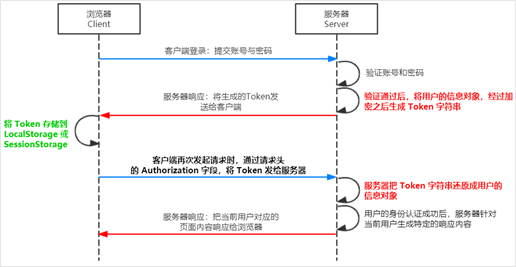
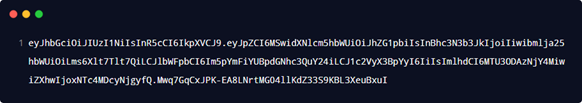
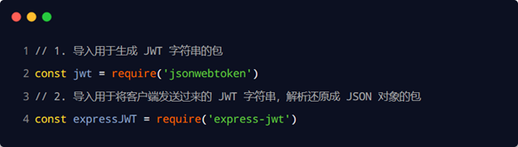
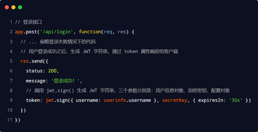
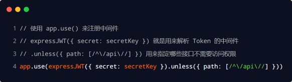
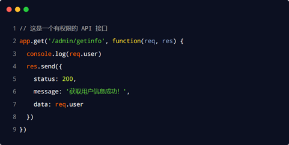
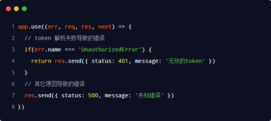

# token身份认证

## 基本概念

  ### 了解Session认证的局限性  

Session 认证机制需要配合 Cookie 才能实现。由于 Cookie 默认不支持跨域访问，所以，当涉及到前端跨域请求后端接口的时候，**需要做很多额外的配置**，才能实现跨域 Session 认证。


注意：

+ 当前端请求后端接口**不存在跨域问题**的时候，**推荐使用** **Session** 身份认证机制。

+ 当前端需要跨域请求后端接口的时候，不推荐使用 Session 身份认证机制，推荐使用 JWT 认证机制。


### 什么是token

JWT（英文全称：JSON Web Token）是目前**最流行**的**跨域认证解决方案**。


### jwt的原理



总结：用户的信息通过 Token 字符串的形式，保存在客户端浏览器中。服务器通过还原 Token 字符串的形式来认证用户的身份。

### jwt的组成

JWT 通常由三部分组成，分别是 Header（头部）、Payload（有效荷载）、Signature（签名）。

三者之间使用英文的“.”分隔，格式如下：


例如




### JWT的三个部分各自代表的含义

JWT 的三个组成部分，从前到后分别是 Header、Payload、Signature。

其中：

+ payload** 部分**才是真正的用户信息**，它是用户信息经过加密之后生成的字符串。

+ Header 和 Signature 是**安全性相关**的部分，只是为了保证 Token 的安全性。


### jwt的使用方式

客户端收到服务器返回的 JWT 之后，通常会将它储存在` localStorage` 或` sessionStorage` 中。

此后，客户端每次与服务器通信，都要带上这个 JWT 的字符串，从而进行身份认证。推荐的做法是**把** **JWT** **放在** **HTTP** **请求头的** **Authorization** **字段中**，格式如下：


## 在express中使用jwt

运行如下命令，安装如下两个 JWT 相关的包：


其中：

+ **jsonwebtoken** 用于**生成** **JWT** **字符串**

+ **express-jwt** 用于**将** **JWT** **字符串解析还原成** **JSON** **对象**

### 导入jwt的包



### 定义secret密钥

为了保证 JWT 字符串的安全性，防止 JWT 字符串在网络传输过程中被别人破解，我们需要专门定义一个用于**加密**和**解密**的 secret 密钥：

①当生成 JWT 字符串的时候，需要使用 secret 密钥对用户的信息进行加密，最终得到加密好的 JWT 字符串

②当把 JWT 字符串解析还原成 JSON 对象的时候，需要使用 secret 密钥进行解密


### **在登录成功****后生成** **JWT** **字符串**

调用 **jsonwebtoken** 包提供的 **sign()** 方法，将用户的信息加密成 JWT 字符串，响应给客户端：

	


### **将** **JWT** **字符串****还原为** **JSON** **对象**

客户端每次在访问那些有权限接口的时候，都需要主动通过**请求头中的** **Authorization** **字段**，将 Token 字符串发送到服务器进行身份认证。

此时，服务器可以通过 **express-****jwt** 这个中间件，自动将客户端发送过来的 Token 解析还原成 JSON 对象：




### **使用** **req.user** **获取用户信息**

当 express-jwt 这个中间件配置成功之后，即可在那些有权限的接口中，使用 **req.user** 对象，来访问从 JWT 字符串中解析出来的用户信息了，示例代码如下：



### **捕获解析** **JWT** **失败后产生的错误**

当使用 express-jwt 解析 Token 字符串时，如果客户端发送过来的 Token 字符串**过期**或**不合法**，会产生一个**解析失败**的错误，影响项目的正常运行。我们可以通过 **Express** **的错误中间件**，捕获这个错误并进行相关的处理，示例代码如下：




```js
jQuery.ajaxSetup({
	beforeSend: function(xhr) {
		xhr.setRequestHeader('Authorization', localStorage.getItem('token'))
	}
})
```

