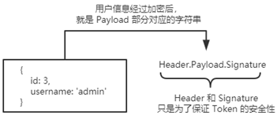

# token身份认证

## 基本概念

  ### 了解Session认证的局限性  

Session 认证机制需要配合 Cookie 才能实现。由于 Cookie 默认不支持跨域访问，所以，当涉及到前端跨域请求后端接口的时候，**需要做很多额外的配置**，才能实现跨域 Session 认证。


注意：

+ 当前端请求后端接口**不存在跨域问题**的时候，**推荐使用** **Session** 身份认证机制。

+ 当前端需要跨域请求后端接口的时候，不推荐使用 Session 身份认证机制，推荐使用 JWT 认证机制。


### 什么是token

JWT（英文全称：JSON Web Token）是目前**最流行**的**跨域认证解决方案**。


### jwt的原理


总结：用户的信息通过 Token 字符串的形式，保存在客户端浏览器中。服务器通过还原 Token 字符串的形式来认证用户的身份。

### jwt的组成

JWT 通常由三部分组成，分别是 Header（头部）、Payload（有效荷载）、Signature（签名）。

三者之间使用英文的“.”分隔，格式如下：


例如


### JWT的三个部分各自代表的含义

JWT 的三个组成部分，从前到后分别是 Header、Payload、Signature。

其中：

+ payload** 部分**才是真正的用户信息**，它是用户信息经过加密之后生成的字符串。

+ Header 和 Signature 是**安全性相关**的部分，只是为了保证 Token 的安全性。




### jwt的使用方式

- 前端

1. 客户端收到服务器返回的 JWT 之后，通常会将它储存在` localStorage` 或` sessionStorage` 中。

2. 此后，客户端每次与服务器通信，都要带上这个 JWT 的字符串，从而进行身份认证。推荐的做法是**把** **JWT** **放在** **HTTP** **请求头的** **`Authorization`** **字段中**，格式如下：

   ```js
   Authorization: Bearer <token>
   ```

- 后端
  1. 登录成功, 生成token, 返回给浏览器
  2. 所有的接口中. 判断请求头是否携带了token(登录页面除外)

## 在express中使用jwt

运行如下命令，安装如下两个 JWT 相关的包：

```bash
npm i jsonwebtoken express-jwt
```

其中：

+ [jsonwebtoken](https://www.npmjs.com/package/jsonwebtoken) 用于**生成** **JWT** **字符串**

+ [express-jwt](https://www.npmjs.com/package/express-jwt) 用于**将** **JWT** **字符串解析还原成** **JSON** **对象**

### 定义secret密钥

为了保证 JWT 字符串的安全性，防止 JWT 字符串在网络传输过程中被别人破解，我们需要专门定义一个用于**加密**和**解密**的 secret 密钥：

①当生成 JWT 字符串的时候，需要使用 secret 密钥对用户的信息进行加密，最终得到加密好的 JWT 字符串

②当把 JWT 字符串解析还原成 JSON 对象的时候，需要使用 secret 密钥进行解密

```js
const SECRET_KEY = 'login2021'
```

### 在登录成功后生成 JWT 字符串

调用 **jsonwebtoken** 包提供的 **sign()** 方法，将用户的信息加密成 JWT 字符串，响应给客户端：

```js
// v1Router.js
const v1Router = express.Router()
const jwt = require('jsonwebtoken')
const SECRET_KEY = 'login2021'

// 登录接口
v1Router.post('/login', (req, res) => {
  // 校验密码....(此处省略), 如果校验成功, 生成jwt
  // 参数1: 生成到token中的信息
  // 参数2: 密钥
  // 参数3: token的有效时间: 60, "2 days", "10h", "7d"
  const token = jwt.sign(
    { user: { name: 'zs', password: 123 } },
    SECRET_KEY,
    { expiresIn: '3h' }
  )
  console.log('🚀 → token', token)
  res.send({
    status: 200,
    message: 'login success!',
    token,
  })
})	
```

### 解析 JWT字符串 还原为JSON对象

客户端每次在访问那些有权限接口的时候，都需要主动通过**请求头中的 `Authorization` 字段**，将 Token 字符串发送到服务器进行身份认证。

此时，服务器可以通过 **express-jwt** 这个中间件，自动将客户端发送过来的 Token 解析还原成 JSON 对象：

```js
// app.js
// 导入校验token的模块, 解析JWT字符串, 还原成 JSON 对象 的模块
const parseJwt = require('express-jwt')
const SECRET_KEY = 'login2021' // 与生成token的密钥要一致!

// 1. 使用中间件解析token
// 2. 使用 .unless 排除无需校验的路由(比如: 登录)
app.use(
  parseJwt({
      sectet: SECRET_KEY,
      algorithms: ['HS256'], // 使用何种加密算法解析
  })
    .unless({ path: ['/v1/login'] })
)
```

### 使用req.user 获取用户信息

当 express-jwt 这个中间件配置成功之后，即可在那些有权限的接口中，使用 **req.user** 对象，来访问从 JWT 字符串中解析出来的用户信息了，示例代码如下：


### 错误中间件

> 用来统一处理捕获的错误
>
> 当使用 express-jwt 解析 Token 字符串时，如果客户端发送过来的 Token 字符串**过期**或**不合法**，会产生一个**解析失败**的错误，影响项目的正常运行。我们可以通过 **Express** **的错误中间件**，捕获这个错误并进行相关的处理，示例代码如下：

```js
// 定义错误中间件
// middleware/errorhandler.js
function errorHandler(err, req, res, next) {
  console.log(err, err.name);
  let code = 500;
  let message = 'Internal Server Error';
  // token解析的错误
  if (err.name === 'UnauthorizedError') {
    code = 401
    message = 'no login'
  }
  res.statusCode = code;
  res.send({
    status: code,
    message,
  })
}

module.exports = errorHandler
```

```js
// app.js
const errorhandler = require('middleware')

// 错误中间件写在最后
app.use(errorhandler)
```

### 前端如何使用token

1. 保存token

```js
const token = this.axios.post('v1/login', {...});
localStorage.setItem('token', token);
```

2. 请求时 携带token

```js
const axios = require('axios').default;
const instance = axios.create({
    baseURL: 'http://localhost:8001/v1',
});

// 可在axios拦截中统一处理
instance.interceptors.request.use((config) => {
    config.headers = {
        ...config.headers,
        // 如果后端没有添加 'Bearer ', 则需要前端自己拼接
        Authorization: localStorage.getItem('token'),
    }
})
```

